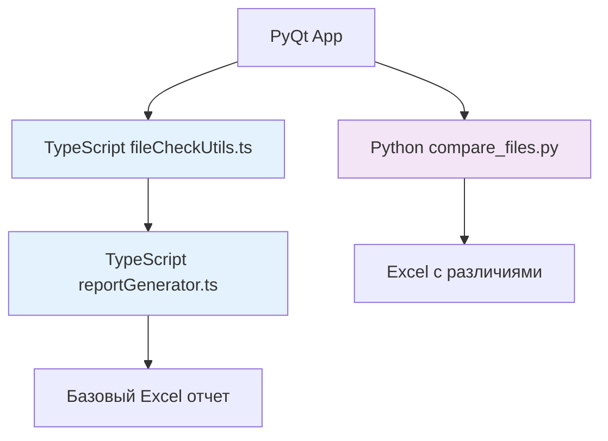
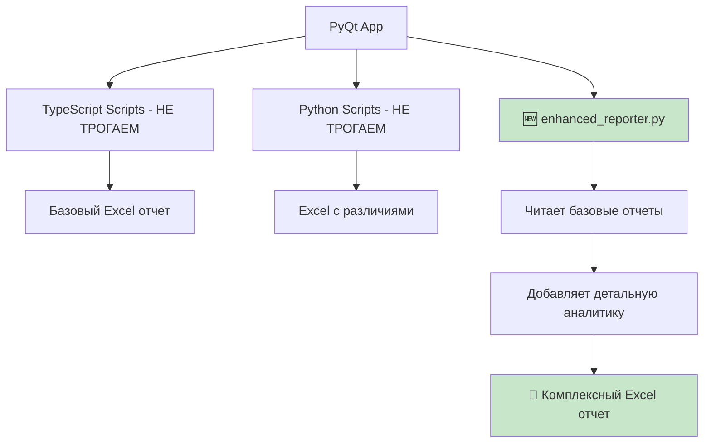

# 📊 План создания расширенной отчетности (минимальные изменения)

## 🎯 Цель: Добавить детальную отчетность БЕЗ изменения существующего функционала

**Принцип:** Создать дополнительный Python скрипт, который **дополняет** существующие отчеты, а не заменяет их.

---

## 🏗️ Текущая архитектура (НЕ ТРОГАЕМ!)



## 🚀 Новая архитектура (ДОБАВЛЯЕМ)



---

## 📋 План реализации (3-4 часа максимум)

### **🎯 Шаг 1: Создать enhanced_reporter.py (2 часа)**

#### **Файл для создания:**
- `silk/scripts/enhanced_reporter.py` - Дополнительный анализатор отчетов

**Что делает:**
1. Читает **существующие** отчеты (из TypeScript и Python)
2. Анализирует их и извлекает дополнительную информацию
3. Создает **расширенный многослойный Excel отчет**
4. **НЕ дублирует** существующую логику проверки файлов

#### **Структура:**
```python
class EnhancedReporter:
    def __init__(self):
        self.base_reports_dir = Path("results")
        self.enhanced_reports_dir = Path("results/enhanced")
    
    def create_enhanced_report(self, excel_path, directory_path):
        """
        Главная функция - создает расширенный отчет
        НЕ проверяет файлы заново, только анализирует существующие отчеты
        """
        
        # 1. Ищем последние базовые отчеты
        typescript_report = self.find_latest_typescript_report()
        python_report = self.find_latest_python_report()
        
        # 2. Извлекаем данные из базовых отчетов
        base_data = self.extract_base_data(typescript_report, python_report)
        
        # 3. Добавляем расширенную аналитику
        enhanced_data = self.add_enhanced_analytics(base_data, excel_path, directory_path)
        
        # 4. Создаем многослойный Excel отчет
        report_path = self.create_multi_sheet_excel(enhanced_data)
        
        return {
            'success': True,
            'report_path': report_path,
            'base_reports_used': [typescript_report, python_report],
            'enhancement_summary': enhanced_data['summary']
        }
```

---

### **🎯 Шаг 2: Интегрировать в PyQt (1 час)**

#### **Файлы для изменения:**
- `silk/pyqt_app/pages/upload_page.py` - Добавить одну кнопку

**Изменения:**
```python
# В setup_ui() добавить новую кнопку:
enhanced_report_button = QPushButton("СОЗДАТЬ ДЕТАЛЬНЫЙ ОТЧЕТ")
enhanced_report_button.setStyleSheet("""
    QPushButton {
        background-color: #2196F3;
        color: white;
        border-radius: 15px;
        padding: 15px 25px;
        font-weight: bold;
    }
""")
enhanced_report_button.clicked.connect(self.create_enhanced_report)

# Новый метод:
def create_enhanced_report(self):
    """Создает расширенный отчет на основе существующих"""
    try:
        from scripts.enhanced_reporter import EnhancedReporter
        
        self.show_status('loading', "Создание детального отчета...")
        
        reporter = EnhancedReporter()
        result = reporter.create_enhanced_report(
            self.excel_file_path, 
            self.directory_path
        )
        
        if result['success']:
            self.show_status('success', f"Детальный отчет создан: {result['report_path']}")
            self.offer_open_enhanced_report(result['report_path'])
        else:
            self.show_status('error', f"Ошибка создания отчета: {result.get('message', 'Неизвестная ошибка')}")
            
    except Exception as e:
        self.show_status('error', f"Ошибка: {str(e)}")
```

---

### **🎯 Шаг 3: Создать детальный Excel генератор (1 час)**

#### **Встроить в enhanced_reporter.py:**

```python
def create_multi_sheet_excel(self, enhanced_data):
    """Создает Excel с 6 листами детальной аналитики"""
    
    timestamp = datetime.now().strftime("%Y%m%d_%H%M%S")
    output_file = self.enhanced_reports_dir / f"enhanced_report_{timestamp}.xlsx"
    
    with pd.ExcelWriter(output_file, engine='openpyxl') as writer:
        # Лист 1: 📊 Исполнительная сводка
        self.create_executive_summary(writer, enhanced_data)
        
        # Лист 2: 🔍 Детальный анализ файлов  
        self.create_detailed_analysis(writer, enhanced_data)
        
        # Лист 3: 📈 Статистика и тренды
        self.create_statistics_sheet(writer, enhanced_data)
        
        # Лист 4: ⚠️ Проблемы и рекомендации
        self.create_issues_recommendations(writer, enhanced_data)
        
        # Лист 5: 🎯 План действий
        self.create_action_plan(writer, enhanced_data)
        
        # Лист 6: 📋 Исходные данные (ссылки на базовые отчеты)
        self.create_source_data_sheet(writer, enhanced_data)
    
    return str(output_file)

def create_executive_summary(self, writer, data):
    """Исполнительная сводка - главный лист для руководства"""
    summary_data = [
        ['ИСПОЛНИТЕЛЬНАЯ СВОДКА', '', ''],
        ['Дата анализа', datetime.now().strftime('%d.%m.%Y %H:%M'), ''],
        ['Проанализировано релизов', data['stats']['total_releases'], ''],
        ['', '', ''],
        
        ['🎯 ОБЩАЯ ОЦЕНКА', '', ''],
        ['Готовность к загрузке', data['readiness']['status'], data['readiness']['percentage']],
        ['Критических проблем', data['issues']['critical_count'], ''],
        ['Предупреждений', data['issues']['warning_count'], ''],
        ['', '', ''],
        
        ['📊 СТАТИСТИКА ФАЙЛОВ', '', ''],
        ['Всего файлов в Excel', data['stats']['total_files_excel'], ''],
        ['Найдено в директории', data['stats']['found_files'], ''],  
        ['Отсутствует', data['stats']['missing_files'], ''],
        ['Лишних файлов', data['stats']['extra_files'], ''],
        ['', '', ''],
        
        ['🚨 КРИТИЧЕСКИЕ ПРОБЛЕМЫ', '', ''],
    ]
    
    # Добавляем критические проблемы
    for issue in data['issues']['critical']:
        summary_data.append([f"❌ {issue['type']}", issue['description'], issue['count']])
    
    summary_data.extend([
        ['', '', ''],
        ['💡 РЕКОМЕНДАЦИИ', '', ''],
    ])
    
    # Добавляем топ-3 рекомендации
    for rec in data['recommendations']['top_3']:
        summary_data.append([f"✅ {rec['action']}", rec['description'], rec['priority']])
    
    df = pd.DataFrame(summary_data, columns=['Параметр', 'Значение', 'Детали'])
    df.to_excel(writer, sheet_name='📊 Сводка', index=False)
    
    # Применяем стили
    self.apply_executive_summary_styles(writer.sheets['📊 Сводка'])
```

---

## 🔧 Детали реализации

### **📋 Функции enhanced_reporter.py:**

#### **1. Анализ существующих отчетов:**
```python
def extract_base_data(self, typescript_report, python_report):
    """Извлекает данные из базовых отчетов"""
    data = {}
    
    # Читаем TypeScript отчет (если есть)
    if typescript_report and os.path.exists(typescript_report):
        ts_data = pd.read_excel(typescript_report, sheet_name=None)  # Все листы
        data['typescript'] = {
            'comparison': ts_data.get('Сравнение файлов', pd.DataFrame()),
            'summary': ts_data.get('Сводка', pd.DataFrame()),
            'missing': ts_data.get('Отсутствующие файлы', pd.DataFrame()),
            'unused': ts_data.get('Неиспользуемые файлы', pd.DataFrame())
        }
    
    # Читаем Python отчет (если есть)
    if python_report and os.path.exists(python_report):
        py_data = pd.read_excel(python_report, sheet_name='Результаты')
        data['python'] = {
            'differences': py_data
        }
    
    return data

def add_enhanced_analytics(self, base_data, excel_path, directory_path):
    """Добавляет расширенную аналитику к базовым данным"""
    enhanced = {
        'base_data': base_data,
        'stats': self.calculate_enhanced_stats(base_data),
        'readiness': self.assess_readiness(base_data),
        'issues': self.categorize_issues(base_data),
        'recommendations': self.generate_recommendations(base_data),
        'trends': self.analyze_trends(base_data),
        'action_plan': self.create_action_plan_data(base_data)
    }
    
    return enhanced
```

#### **2. Интеллектуальная аналитика:**
```python
def assess_readiness(self, base_data):
    """Оценивает готовность релиза к загрузке"""
    score = 100
    issues = []
    
    # Анализируем данные из TypeScript отчета
    if 'typescript' in base_data:
        missing_count = len(base_data['typescript']['missing'])
        if missing_count > 0:
            score -= missing_count * 10  # -10 баллов за каждый отсутствующий файл
            issues.append(f"Отсутствует {missing_count} файлов")
    
    # Анализируем данные из Python отчета  
    if 'python' in base_data:
        low_similarity = base_data['python']['differences'][
            base_data['python']['differences']['Процент сходства'] < 80
        ]
        if len(low_similarity) > 0:
            score -= len(low_similarity) * 5  # -5 баллов за каждый файл с низким сходством
            issues.append(f"{len(low_similarity)} файлов с низким сходством")
    
    # Определяем статус
    if score >= 95:
        status = "✅ ГОТОВ К ЗАГРУЗКЕ"
    elif score >= 80:
        status = "⚠️ ГОТОВ С ПРЕДУПРЕЖДЕНИЯМИ" 
    elif score >= 60:
        status = "🔧 ТРЕБУЕТ ИСПРАВЛЕНИЙ"
    else:
        status = "❌ НЕ ГОТОВ К ЗАГРУЗКЕ"
    
    return {
        'score': max(0, score),
        'percentage': f"{max(0, score)}%",
        'status': status,
        'issues': issues
    }

def generate_recommendations(self, base_data):
    """Генерирует рекомендации на основе анализа"""
    recommendations = []
    
    # Анализируем типичные проблемы и предлагаем решения
    if 'python' in base_data:
        differences = base_data['python']['differences']
        
        # Рекомендации по именам файлов
        common_issues = self.find_common_naming_issues(differences)
        for issue_type, files in common_issues.items():
            if issue_type == 'encoding':
                recommendations.append({
                    'priority': 'HIGH',
                    'action': 'Исправить кодировку',
                    'description': f'Обнаружены проблемы с кодировкой в {len(files)} файлах',
                    'files': files,
                    'solution': 'Переименовать файлы в UTF-8 кодировке'
                })
    
    return {
        'all': recommendations,
        'top_3': sorted(recommendations, key=lambda x: x['priority'], reverse=True)[:3]
    }
```

---

## ⏰ Временной план

### **🚀 Реализация за 3-4 часа:**

1. **Час 1:** Создать базовую структуру `enhanced_reporter.py`
   - Функции чтения существующих отчетов
   - Базовая структура данных

2. **Час 2:** Добавить аналитические функции
   - Оценка готовности
   - Категоризация проблем  
   - Генерация рекомендаций

3. **Час 3:** Создать Excel генератор
   - 6 листов детальной отчетности
   - Стилизация и форматирование

4. **Час 4:** Интеграция с PyQt
   - Добавить кнопку в интерфейс
   - Тестировать работу

---

## 🎯 Преимущества этого подхода

### **✅ Что получаем:**
- **Сохраняем** всю существующую функциональность
- **Не ломаем** TypeScript скрипты
- **Минимальные** изменения в коде
- **Максимальная** отдача от времени

### **📊 Новые возможности:**
- Исполнительная сводка для принятия решений
- Интеллектуальная оценка готовности релиза
- Автоматические рекомендации по исправлению
- План действий для исправления проблем
- Анализ трендов и паттернов ошибок

### **🔧 Техническая простота:**
- Один новый файл `enhanced_reporter.py`
- Одна новая кнопка в интерфейсе  
- Работает **поверх** существующих отчетов
- Не требует изменения архитектуры

**Готов начать реализацию этого плана?** 🚀 